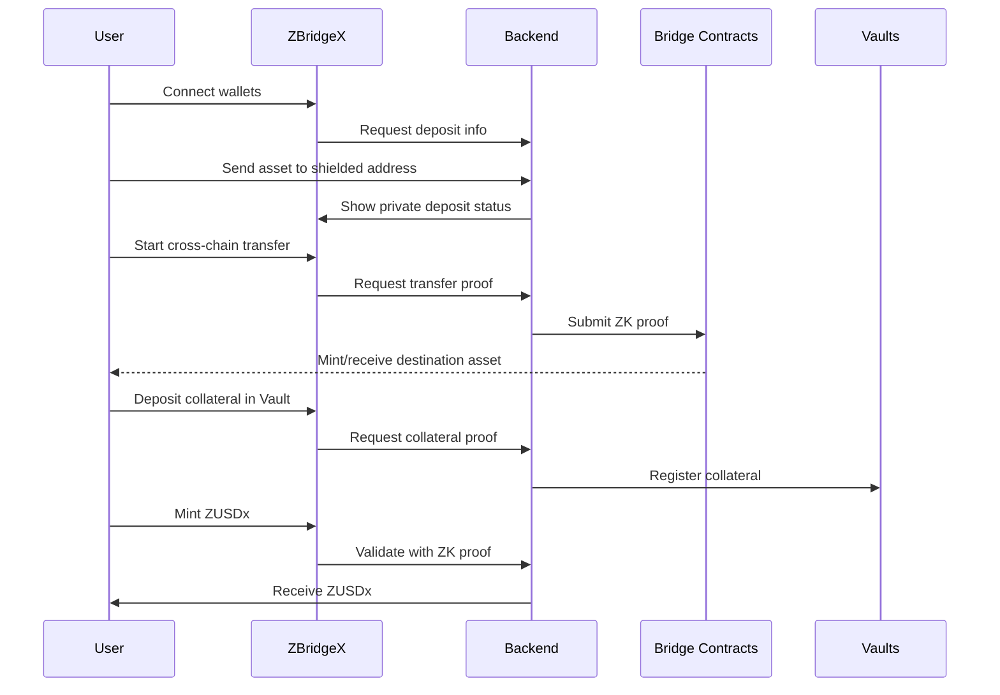
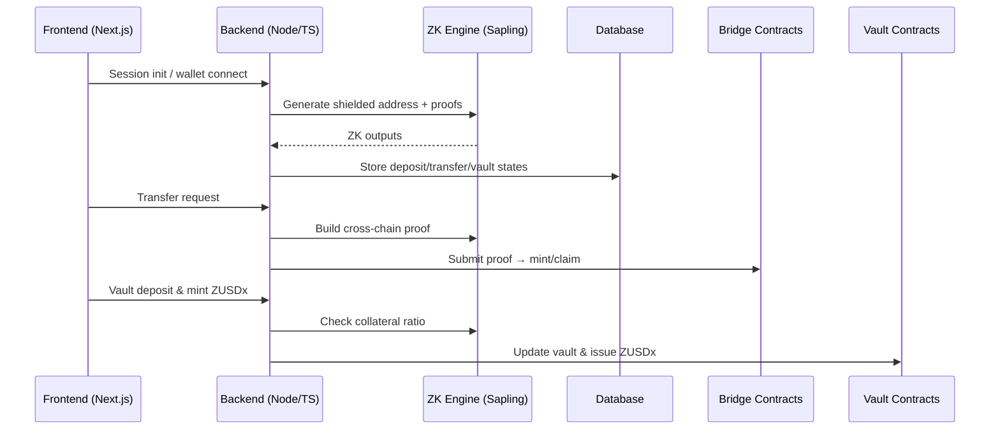

  

  <a href="" style="color: #a77dff">Website</a> | <a href="" style="color: #a77dff">Demo Video</a> | <a href="https://www.figma.com/deck/jYmED8mcIOLXFMFVNgCIZS" style="color: #a77dff">Pitchdeck</a>

## Background

As the multi chain ecosystem expands, users increasingly move assets across networks such as NEAR, Solana, Starknet, Mina, and Ethereum L2s. However, each chain requires separate wallets, bridges, and liquidity layers, creating a fragmented and inconvenient user experience.

Additionally, blockchain transactions are inherently public: balances, transaction history, positions, and even strategies can be traced by anyone.
Existing privacy bridges or mixer style solutions only solve privacy on single chains and cannot provide **multi chain private asset mobility**. Meanwhile, traditional bridge models generate minimal fees and struggle to establish sustainable long-term economics.

ZBridgeX addresses these challenges by integrating a **privacy bridge, a private stablecoin, and private vault infrastructure** into one unified ecosystem a “multi chain private liquidity layer.”

## Problems

The current ecosystem faces several critical issues:

- No unified privacy model for cross chain transfers; privacy remains chain specific and fragmented.
- Moving assets, swapping, and using DeFi across chains exposes all on chain activity, including balances, strategies, and flows.
- There is no chain agnostic **private stable unit of account** that users can rely on across multiple networks.
- Privacy only bridges lack long-term revenue models and operate purely as fee based utilities.
- There is no integrated infrastructure for privacy preserving lending, RWA, swaps, margin trading, or yield strategies.

As a result, **privacy, interoperability, liquidity, sustainability, and scalability remain disconnected.**

## What ZBridgeX Solves

ZBridgeX solves these problems through three tightly connected components:

- **ZBridgeX**

  - A Zcash Sapling powered privacy bridge that enables shielded, private cross-chain transfers using ZK-SNARKs.

- **ZUSDx**

  - An over collateralized private stablecoin minted from shielded vault collateral and usable across all supported chains.

- **ZBridgeX Vaults**
  - A private collateral and yield layer that enables users to lock assets, mint ZUSDx, generate yield, and support future RWA expansion all while maintaining full privacy.

Together, they form a complete “privacy bridge + unified stable liquidity + privacy DeFi engine.”

## Why This Is Necessary

In a multi-chain world, users want:

- Seamless movement of assets across chains
- Complete privacy for balances and strategies
- A stable, chain agnostic currency
- Access to lending, yield, payments, and RWA while keeping activity private

> However, current solutions only offer one of these not all.

ZBridgeX, centered around ZUSDx, provides:

- A single currency for private cross-chain activity
- A unified liquidity base for all chains
- A vault powered economy that generates sustainable value for both users and the protocol

> This creates the foundation for a **privacy preserving multi chain financial system**.

## Why ZBridgeX Is Different

ZBridgeX differs fundamentally from existing privacy bridges:

- It is not merely a private transfer tool it is a **multi chain financial hub** built around a stablecoin and vaults.
- ZUSDx unifies liquidity across all supported chains into one stable private currency.
- Vaults extend the system into collateralized minting, yield generation, and future RWA integration.
- All ZK operations run server side, giving users the same ease of use as normal bridging.

## Key Features

| Area                | Function                                   | Description                                                                                                                                                |
| ------------------- | ------------------------------------------ | ---------------------------------------------------------------------------------------------------------------------------------------------------------- |
| Privacy Bridge      | ZBridgeX                                   | A multi chain privacy bridge using Zcash Sapling and ZK-SNARKs. Transfers remain private no exposed balances, history, or strategies.                      |
| Stablecoin          | ZUSDx                                      | Over collateralized private stablecoin minted from shielded vault collateral. Used as a private, chain agnostic currency for payments, bridging, and DeFi. |
| Vault Layer         | ZBridgeX Vaults                            | Private collateral deposits, ZUSDx minting, yield strategies, and future RWA support. Forms the liquidity and revenue foundation of the ecosystem.         |
| ZK Privacy Engine   | Sapling + Custom Circuits                  | Generates and verifies nullifiers, commitments, and cross-chain mapping proofs. Server side architecture simplifies UX and enhances security.              |
| Multi Chain Support | NEAR, Solana, Starknet, Mina, Ethereum L2s | One unified interface for all supported chains; users no longer need multiple bridges or tools.                                                            |
| UX & Security       | Server Side ZK Computation                 | Avoids heavy in browser proving. Users connect wallets and bridge assets with fast, simple workflows.                                                      |
| Revenue Model       | Bridge fees, Stablecoin & Vault Economics  | Sustainable income from mint/burn fees, stability fees, vault interest, liquidation fees, and yield spreads.                                               |

## User Flow

## Technical Architecture

## Conclusion

ZBridgeX goes beyond the limitations of existing bridges and privacy tools by integrating privacy, interoperability, stable liquidity, vault economics, and sustainable revenue into one system.
ZUSDx is the cornerstone of this ecosystem unifying liquidity across chains, enabling private financial activity, and powering the protocol’s long-term economic model.
Ultimately, ZBridgeX is not just a privacy bridge.
It is a **multi chain financial hub** and the first fully integrated foundation for a private cross chain economy.
