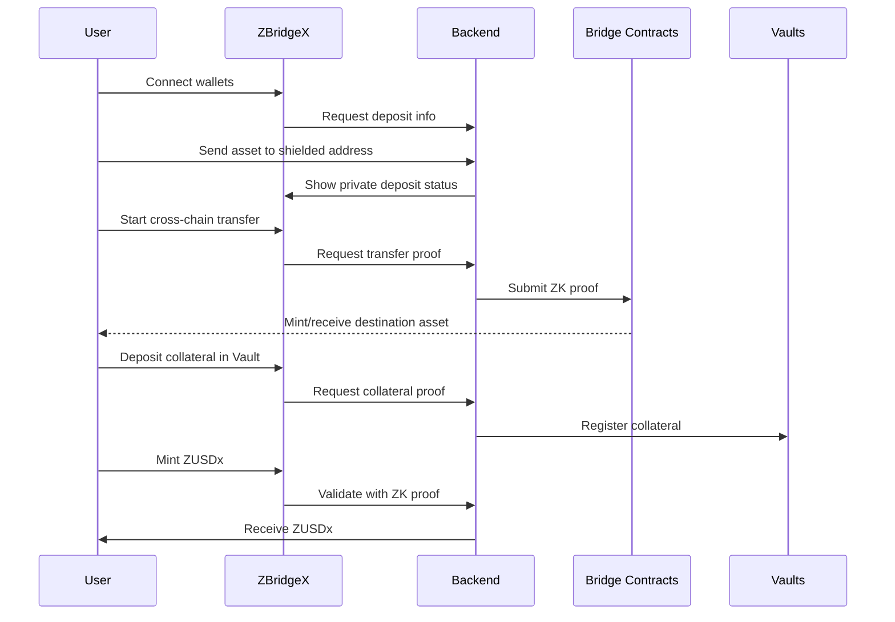
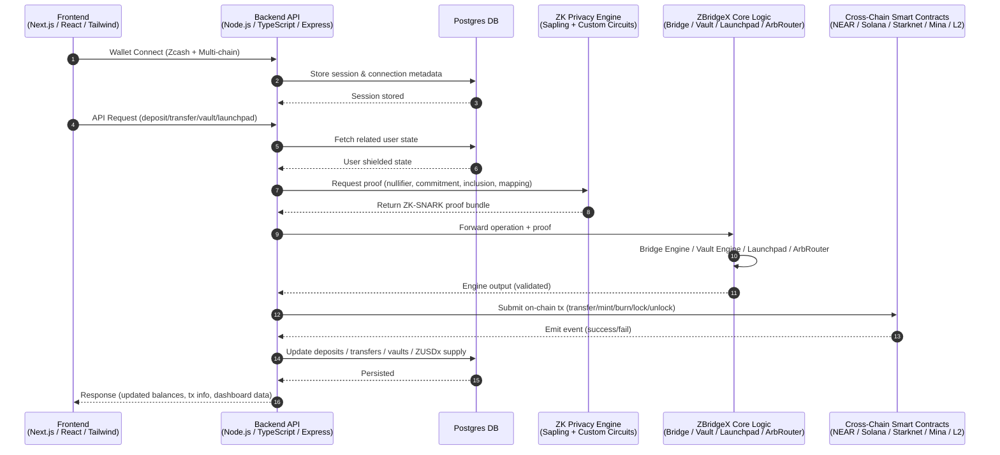

  

  <a href="" style="color: #a77dff">Website</a> | <a href="" style="color: #a77dff">Demo Video</a> | <a href="https://www.figma.com/deck/jYmED8mcIOLXFMFVNgCIZS" style="color: #a77dff">Pitchdeck</a>

## Background

As the multi-chain ecosystem grows, users increasingly move assets across networks such as NEAR, Solana, Starknet, Mina, and Ethereum L2s. Each chain requires separate wallets, bridges, and liquidity layers, creating a fragmented and inconvenient user experience.

Blockchain transactions are inherently public: balances, transaction history, positions, and strategies can be traced by anyone. Existing privacy bridges or mixer solutions only address privacy on single chains and cannot provide multi-chain private asset mobility. Traditional bridges struggle with sustainable economic models.

**ZBridgeX addresses these challenges** by integrating a privacy bridge, a private stablecoin, private vaults, a launchpad, and a private routing engine into a unified ecosystem a “multi-chain private liquidity layer.”

## Problems

Current multi-chain ecosystems face several issues:

- No unified privacy model for cross-chain transfers; privacy is chain-specific and fragmented.
- Moving assets, swapping, and interacting with DeFi across chains exposes balances, strategies, and flows.
- No chain-agnostic private stable unit of account exists across multiple networks.
- Privacy-only bridges lack long-term revenue models and operate purely as fee-based utilities.
- No integrated infrastructure exists for privacy-preserving lending, swaps, routing, or yield strategies.

> As a result, privacy, interoperability, liquidity, sustainability, and scalability remain disconnected.

## What ZBridgeX Solves

ZBridgeX solves these problems through five tightly connected components:

1. ZBridgeX (Privacy Bridge)
   - Function: Zcash Sapling powered cross-chain privacy bridge.
   - Capabilities: Shielded, private transfers across NEAR, Solana, Starknet, Mina, and Ethereum L2s.
   - Privacy: Uses ZK-SNARKs, nullifiers, and cross-chain mapping proofs to conceal balances, transaction history, and strategies.

2. ZUSDx (Private Stablecoin)
   - Function: Over-collateralized private stablecoin.
   - Capabilities: Minted from shielded vault collateral; usable across all supported chains.
   - Utility: Serves as a private, chain-agnostic currency for payments, bridging, and private DeFi.
3. ZBridgeX Vaults (Private Collateral & Yield Layer)
   - Function: Private collateral storage, ZUSDx minting, yield generation, and future RWA integration.
   - Capabilities: Shielded deposits, cross-chain collateral management, private yield strategies.
   - Revenue: Provides protocol sustainability via stability fees, yield spreads, and vault economics.

4. ZBridgeX Launchpad (Private Fundraising)
   - Function: Private cross-chain launchpad for projects and contributors.
   - Capabilities: Users participate in token sales, contributions, and claims without revealing identity or asset holdings.
   - Benefit: Showcases real-world private use cases and drives ecosystem adoption.

5. ZBridgeX ArbRouter (Private Routing Engine)
   - Function: Private multi-chain routing and liquidity optimization.
   - Capabilities: Conceals route intent, selects optimal paths, and reduces MEV risk.
   - Benefit: Aggregates liquidity and ensures private, efficient cross-chain transfers.

## Why This Is Necessary

Users require:

- Seamless movement of assets across multiple chains
- Complete privacy for balances, positions, and strategies
- A stable, chain-agnostic currency
- Access to lending, yield, payments, and future DeFi products while maintaining privacy

Current solutions only address some of these needs. **ZBridgeX provides all of them in a single ecosystem**, centered around ZUSDx as a unifying currency.

## Why ZBridgeX Is Different

- Not merely a bridge; it is a multi-chain financial hub.
- ZUSDx unifies liquidity across chains into a single private currency.
- Vaults enable collateralized minting, yield generation, and future RWA integration.
- All ZK operations are server-side, ensuring usability comparable to traditional bridges.

## Key Features

| **Area**                | **Component**                              | **Function**        | **Description**                                                                 |
| ----------------------- | ------------------------------------------ | ------------------- | ------------------------------------------------------------------------------- |
| **Privacy Bridge**      | ZBridgeX                                   | Multi-chain bridge  | Shielded transfers; no exposed balances, history, or strategies                 |
| **Stablecoin**          | ZUSDx                                      | Private currency    | Over-collateralized, cross-chain stablecoin for private payments & DeFi         |
| **Vault Layer**         | ZBridgeX Vaults                            | Collateral & yield  | Shielded deposits, ZUSDx minting, yield strategies, RWA-ready                   |
| **Launchpad**           | ZBridgeX Launchpad                         | Private fundraising | Shielded contributions, token claims, multi-chain project access                |
| **Routing Engine**      | ZBridgeX ArbRouter                         | Private routing     | Multi-chain liquidity routing, MEV protection, optimal path selection           |
| **ZK Engine**           | Sapling + Custom Circuits                  | Proof generation    | Nullifiers, commitments, cross-chain mapping proofs, server-side ZK computation |
| **Multi-chain Support** | NEAR, Solana, Starknet, Mina, Ethereum L2s | Unified interface   | One platform supporting all chains                                              |
| **UX & Security**       | Server-side ZK computation                 | Simple workflow     | Low latency, fast, secure, no heavy in-browser proving                          |
| **Revenue Model**       | Fees & Vault economics                     | Sustainability      | Bridge fees, mint/burn fees, stability fees, yield spreads                      |

## User Flow

## Technical Architecture

## Conclusion

ZBridgeX goes beyond the limitations of existing bridges and **privacy tools by integrating privacy, interoperability, stable liquidity, vault economics, launchpad functionality, and routing intelligence** into one system.

**ZUSDx is the cornerstone**, unifying liquidity across chains, enabling private financial activity, and powering long-term economic sustainability.

Ultimately, **ZBridgeX is not just a privacy bridge it is the first fully integrated multi-chain financial hub**, capable of supporting private cross-chain DeFi, yield, and fundraising, with a roadmap toward lending, swaps, and more.
